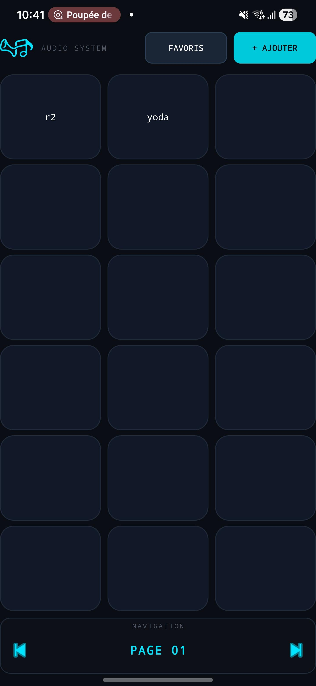
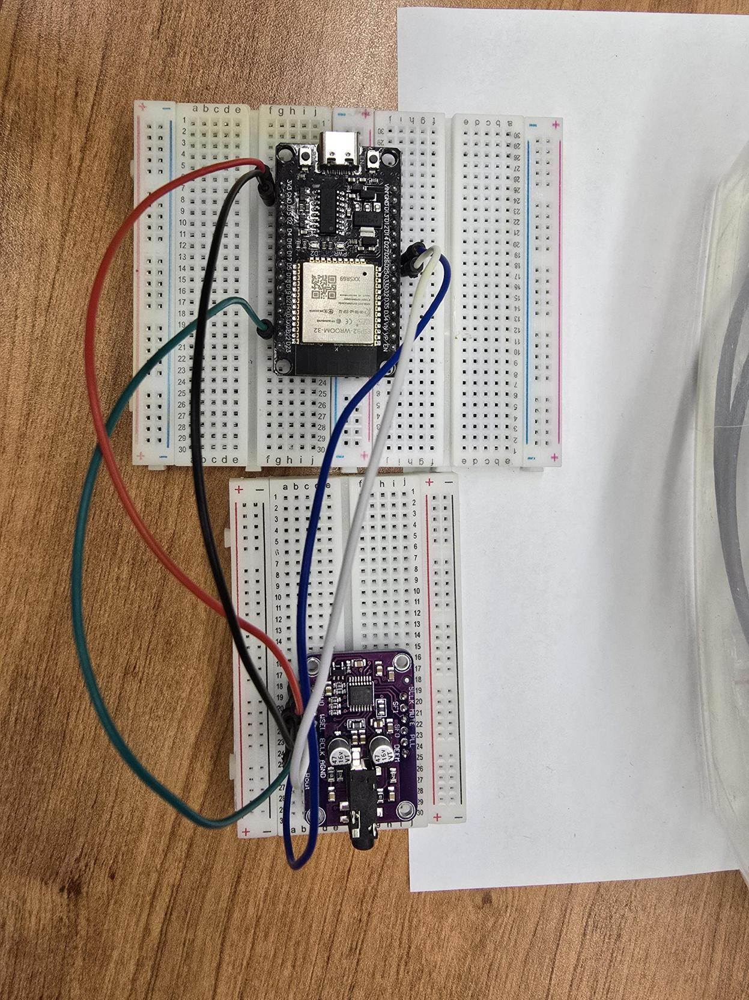

# 🎵 Audio System — Soundboard Android + Récepteur ESP32

> Application Android de soundboard connectée sans fil à un récepteur audio ESP32 via Bluetooth A2DP, avec sortie numérique I2S vers un DAC stéréo UDA1334A by AdaFruit.

---

## Table des matières

- [Vue d'ensemble du système](#vue-densemble-du-système)
- [Démo visuelle](#démo-visuelle)
- [Partie 1 — Application Android (Soundboard)](#partie-1--application-android-soundboard)
  - [Fonctionnalités](#fonctionnalités-android)
  - [Architecture MVVM](#architecture-mvvm)
  - [Structure du projet](#structure-du-projet-android)
  - [Base de données Room](#base-de-données-room)
- [Partie 2 — Récepteur Audio ESP32](#partie-2--récepteur-audio-esp32)
  - [Matériel utilisé](#matériel-utilisé)
  - [Schéma de câblage](#schéma-de-câblage)
  - [Code source](#code-source)
  - [Librairies](#librairies)
- [Flux de données global](#flux-de-données-global)
- [Installation & déploiement](#installation--déploiement)
- [Dépendances](#dépendances)

---

## Vue d'ensemble du système

Ce projet est composé de **deux composants complémentaires** qui forment ensemble un système audio sans fil complet :

| Composant | Technologie | Rôle |
|---|---|---|
| **Application Android** | Kotlin · MVVM · Room | Déclenche les sons depuis une grille de boutons |
| **Récepteur ESP32** | Arduino C++ · A2DP · I2S | Reçoit l'audio Bluetooth et l'envoie vers le DAC |

```
┌─────────────────────┐        Bluetooth A2DP        ┌──────────────────┐       I2S        ┌──────────────┐
│   Android App       │  ─────────────────────────►  │     ESP32        │  ─────────────►  │  UDA1334A    │
│   (Soundboard)      │       SBC codec / BT Classic  │   WROOM-32       │  BCLK·WS·DIN     │   DAC I2S    │
└─────────────────────┘                               └──────────────────┘                  └──────┬───────┘
                                                                                                    │
                                                                                             🎧 Sortie audio
                                                                                           (jack 3.5mm stéréo)
```

L'utilisateur sélectionne un son sur son téléphone. L'audio est routé via le profil Bluetooth A2DP vers l'ESP32, qui le transmet en temps réel au DAC UDA1334A via le protocole I2S, produisant une sortie analogique stéréo.

---

## Démo visuelle

<div align="center">

### Interface Android



*Grille 3×6 de pads sonores avec navigation multi-pages et gestion des favoris*

### Montage physique ESP32 + UDA1334A



*ESP32-WROOM-32 (haut) connecté au DAC Adafruit UDA1334A (bas, module violet) via 5 fils sur breadboard*

</div>

---

## Partie 1 — Application Android (Soundboard)

### Fonctionnalités Android

- **Grille de 18 pads** par page, organisés en 3 colonnes × 6 lignes
- **Navigation multi-pages** — nombre de pages illimité
- **Appui court** → lecture immédiate du son via `SoundPool`
- **Appui long (1,5 s)** → menu contextuel (renommer / supprimer / favoris)
- **Glisser-déposer** pour réorganiser les sons dans la grille
- **Système de favoris** avec liste dédiée et accès rapide
- **Couleur personnalisable** par pad
- **Persistance complète** via Room (SQLite) — les sons survivent aux redémarrages
- **Sélection de fichiers audio** via le Storage Access Framework (SAF) d'Android

---

### Architecture MVVM

```
┌──────────────────────────────┐
│      SoundboardActivity      │  ← View  (UI, interactions utilisateur)
│      FavoriteSoundAdapter    │
└─────────────┬────────────────┘
              │  observe LiveData
┌─────────────▼────────────────┐
│     SoundboardViewModel      │  ← ViewModel  (état UI, actions CRUD)
└─────────────┬────────────────┘
              │  appelle
┌─────────────▼────────────────┐
│       SoundRepository        │  ← Repository  (façade DAO)
└─────────────┬────────────────┘
              │  délègue
┌─────────────▼────────────────┐
│           SoundDao           │  ← DAO / Room  (requêtes SQL)
│           SoundDatabase      │
│           Sound (entité)     │
└──────────────────────────────┘
                   ↕
        soundboard_database  ← SQLite (stockage local sur l'appareil)
```

**Flux réactif :**
```
BDD Room  →  Flow<List<Sound>>  →  Repository  →  ViewModel (asLiveData)  →  Activity (observe)
```

---

### Structure du projet Android

```
soundboard_esp/
├── app/src/main/
│   ├── AndroidManifest.xml
│   └── java/com/example/soundboard_esp/
│       ├── MainActivity.kt                  # Redirecteur vers SoundboardActivity
│       ├── data/
│       │   ├── database/
│       │   │   ├── Sound.kt                 # Entité Room (modèle)
│       │   │   ├── SoundDao.kt              # Interface DAO (requêtes CRUD)
│       │   │   └── SoundDatabase.kt         # Singleton RoomDatabase
│       │   └── repository/
│       │       └── SoundRepository.kt       # Couche d'abstraction DAO ↔ ViewModel
│       └── ui/
│           ├── SoundboardActivity.kt        # Activité principale (grille + audio)
│           ├── FavoriteSoundAdapter.kt      # Adaptateur RecyclerView des favoris
│           └── viewmodel/
│               └── SoundboardViewModel.kt   # ViewModel CRUD + navigation pages
└── app/build.gradle.kts                     # Dépendances et configuration
```

---

### Base de données Room

**Schéma de la table `sounds` :**

```sql
sounds (
  id             INTEGER  PRIMARY KEY AUTOINCREMENT,
  name           TEXT,
  filePath       TEXT,        -- URI Android (content://...)
  buttonPosition INTEGER,     -- Position dans la grille : 1 à 18
  pageNumber     INTEGER,     -- Page (0-indexé)
  buttonColor    TEXT,        -- Couleur hex, ex: "#4ECDC4"
  isFavorite     INTEGER      -- 0 ou 1 (booléen SQLite)
)
```

> Les URIs sont persistées via `ContentResolver.takePersistableUriPermission()` pour survivre aux redémarrages.

**Localisation sur l'appareil :**
```
/data/data/com.example.soundboard_esp/databases/soundboard_database
```

---

## Partie 2 — Récepteur Audio ESP32

### Matériel utilisé

| Composant | Référence | Rôle |
|---|---|---|
| Microcontrôleur | **ESP32-WROOM-32** | Bluetooth A2DP + traitement audio + I2S |
| DAC audio | **Adafruit UDA1334A** | Conversion numérique → analogique stéréo |
| Support | Breadboards × 2 | Prototypage sans soudure |
| Connexions | Fils dupont | Liaison ESP32 ↔ DAC |

---

### Schéma de câblage

```
        ESP32-WROOM-32
       ┌──────────────┐
  3.3V ┤──────────────┼──────────────────────────┐
   GND ┤──────────────┼──────────────────────┐   │
       │              │                      │   │
GPIO26 ┤ (BCLK)       ├──────────────────┐   │   │
GPIO25 ┤ (WS / LRCK)  ├───────────────┐  │   │   │
GPIO22 ┤ (DOUT / DIN) ├────────────┐  │  │   │   │
       └──────────────┘            │  │  │   │   │
                                   │  │  │   │   │
        UDA1334A (DAC I2S)         │  │  │   │   │
       ┌──────────────┐            │  │  │   │   │
   DIN ┤◄─────────────┼────────────┘  │  │   │   │
  BCLK ┤◄─────────────┼───────────────┘  │   │   │
  WSEL ┤◄─────────────┼──────────────────┘   │   │
   GND ┤◄─────────────┼──────────────────────┘   │
   VIN ┤◄─────────────┼──────────────────────────┘
       │              │
  LOUT ┤──┐  Sortie audio analogique stéréo
  ROUT ┤──┘  → Jack 3.5mm → 🎧
       └──────────────┘
```

**Tableau de câblage :**

| Broche ESP32 | Broche UDA1334A | Couleur | Description |
|:---:|:---:|:---:|---|
| GPIO **26** | **BCLK** | 🔵 Bleu | Bit Clock — horloge de synchronisation bit |
| GPIO **25** | **WSEL** | ⚪ Blanc | Word Select — sélection canal Gauche / Droit |
| GPIO **22** | **DIN** | 🟢 Teal | Data In — données audio numériques série |
| **3.3V** | **VIN** | 🔴 Rouge | Alimentation 3.3 V du DAC |
| **GND** | **GND** | ⚫ Noir | Masse commune |

> Le protocole **I2S** (Inter-IC Sound) utilise 3 fils de signal : BCLK (horloge bit), WS/LRCK (sélection de mot) et DATA (données série).

---

### Code source

```cpp
#include "AudioTools.h"           // Doit être inclus AVANT BluetoothA2DPSink
#include "BluetoothA2DPSink.h"

using namespace audio_tools;

BluetoothA2DPSink a2dp_sink;
I2SStream i2s;

#define I2S_BCLK 26   // Bit Clock
#define I2S_WS   25   // Word Select (LR Clock)
#define I2S_DOUT 22   // Data Out ESP32 → Data In DAC

void connection_state_changed(esp_a2d_connection_state_t state, void *ptr) {
  if (state == ESP_A2D_CONNECTION_STATE_CONNECTED)
    Serial.println("CONNECTED - audio playing to UDA1334A");
  else if (state == ESP_A2D_CONNECTION_STATE_DISCONNECTED)
    Serial.println("DISCONNECTED");
  else
    Serial.println("CONNECTING...");
}

void setup() {
  Serial.begin(115200);
  esp_task_wdt_deinit();          // Désactivation du watchdog

  // Configuration du flux I2S (format CD : 44.1 kHz, 16 bits, stéréo)
  auto cfg = i2s.defaultConfig(TX_MODE);
  cfg.pin_bck  = I2S_BCLK;
  cfg.pin_ws   = I2S_WS;
  cfg.pin_data = I2S_DOUT;
  cfg.sample_rate     = 44100;
  cfg.bits_per_sample = 16;
  cfg.channels        = 2;
  i2s.begin(cfg);

  // Pipeline : A2DP → I2S
  a2dp_sink.set_output(i2s);
  a2dp_sink.set_on_connection_state_changed(connection_state_changed);
  a2dp_sink.set_auto_reconnect(false);
  a2dp_sink.start("ESP_Speaker");  // Nom Bluetooth visible
}

void loop() {
  // L'audio est géré entièrement en arrière-plan par les librairies
  static unsigned long last_print = 0;
  if (millis() - last_print > 5000) {
    Serial.println("Waiting for connection...");
    last_print = millis();
  }
  delay(100);
}
```

**Paramètres audio configurés :**

| Paramètre | Valeur | Description |
|---|---|---|
| Fréquence d'échantillonnage | **44 100 Hz** | Qualité CD |
| Résolution | **16 bits** | Standard PCM |
| Canaux | **2 (stéréo)** | Gauche + Droit |
| Codec Bluetooth | **SBC** | Décodé automatiquement par la librairie |

---

### Librairies

#### `AudioTools` — *pschatzmann/arduino-audio-tools*

- Fournit la classe `I2SStream` qui abstrait le pilote I2S natif de l'ESP32
- Gère la configuration complète du format audio (sample rate, bits, canaux)
- Sert de **pipeline** entre la source A2DP et la sortie physique I2S
- **Doit être incluse avant** `BluetoothA2DPSink`

#### `BluetoothA2DPSink` — *pschatzmann/ESP32-A2DP*

- Implémente le profil **A2DP Sink** (récepteur Bluetooth audio stéréo)
- L'ESP32 se comporte comme une enceinte Bluetooth
- Décode automatiquement le flux **SBC** en audio PCM brut
- Expose un nom Bluetooth configurable (ici `"ESP_Speaker"`)
- Accepte un objet `AudioStream` comme sortie via `set_output()`

---

## Flux de données global

```
┌────────────────────────┐
│   Application Android  │
│   (Soundboard)         │
│                        │
│  Touche pad ──► SoundPool
│                    │   │
└────────────────────┼───┘
                     │ Audio PCM
                     │ routé vers sortie Bluetooth système
                     ▼
             Bluetooth A2DP
             (codec SBC)
                     │
                     ▼
┌────────────────────────┐
│        ESP32           │
│  BluetoothA2DPSink     │
│  Décodage SBC → PCM    │
│  44100 Hz / 16-bit / 2 ch
│                        │
│  I2SStream (TX_MODE)   │
└────────────┬───────────┘
             │ 3 fils I2S
             │ BCLK · WS · DIN
             ▼
┌────────────────────────┐
│     UDA1334A (DAC)     │
│  Conversion DAC        │
│  Numérique → Analogique│
└────────────┬───────────┘
             │ Signal analogique stéréo
             ▼
     Jack 3.5mm → 🎧 / 🔊
```

---

## Installation & déploiement

### Application Android

1. Ouvrir le projet `soundboard_esp/` dans **Android Studio**
2. Compiler et installer sur un appareil Android (minSdk **24**, targetSdk **36**)
3. Accorder les permissions audio lors du premier lancement
4. Ajouter des sons via le bouton **+ AJOUTER**

### Firmware ESP32

1. Installer **Arduino IDE** avec le support de la carte **ESP32 Dev Module**
2. Installer les librairies via le Library Manager :
   - `arduino-audio-tools` (Phil Schatzmann)
   - `ESP32-A2DP` (Phil Schatzmann)
3. Ouvrir `Audiotransmitter_esp.ino`
4. Sélectionner la carte **ESP32 Dev Module** et le bon port COM
5. Téléverser le sketch
6. Ouvrir le **Moniteur série à 115 200 bauds** pour suivre l'état

### Connexion au système

1. Sur le téléphone Android, aller dans les **paramètres Bluetooth**
2. Se connecter à l'appareil **`ESP_Speaker`**
3. Lancer la lecture d'un son depuis l'application Soundboard
4. L'audio est transmis sans fil et joué via le DAC UDA1334A 🎧

---

## Dépendances

### Android

| Librairie | Version | Rôle |
|---|---|---|
| `androidx.room` | 2.x | Persistance SQLite (ORM) |
| `androidx.lifecycle` | 2.x | ViewModel + LiveData |
| `androidx.recyclerview` | 1.x | Liste des favoris |
| Kotlin KSP | — | Traitement des annotations Room |

### Arduino / ESP32

| Librairie | Auteur | Installation |
|---|---|---|
| `arduino-audio-tools` | Phil Schatzmann | Library Manager / GitHub |
| `ESP32-A2DP` | Phil Schatzmann | Library Manager / GitHub |

> **Note :** La librairie `AudioTools` **doit** être installée **avant** `ESP32-A2DP`.

---

<div align="center">

*Projet réalisé dans le cadre du cours d'électronique — Session Hiver 2026*

</div>
